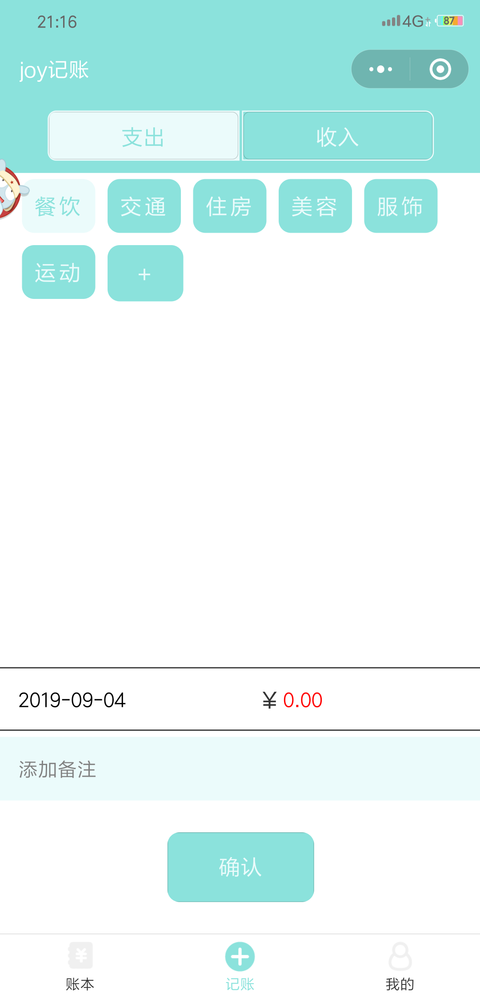
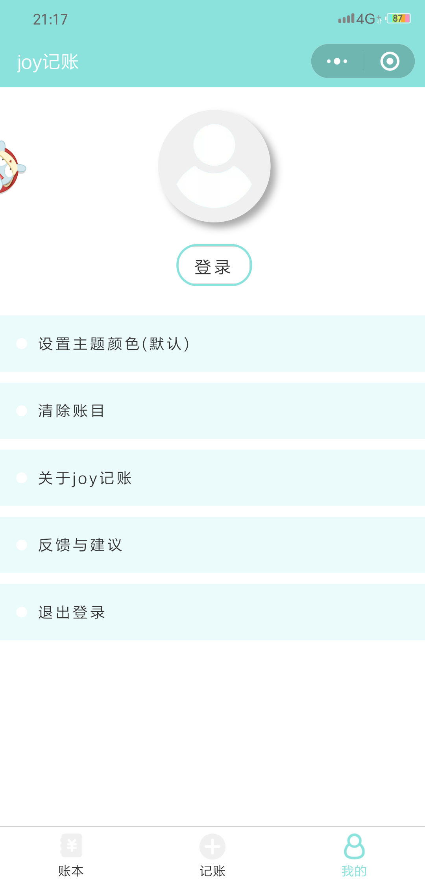

# joyTally
“joy记账”小程序主要实现记账功能，在“记账”页面添加信息后，会自动跳转到“账本”页面，显示当前月的账本信息，若添加的账目不是当前月的，则需在“账本”页面的左上角手动切换到您想展示的页面；在“记账”页面，可以记录您的收入/支出信息，有一些默认的收入/支出类型，您也可以自主添加类型，长按某个类型可以选择删除；在“我的”页面您可以自主设置主题颜色，您可以清除所有的账目信息（删除之后不可复原，要慎重哦~），您可以选择用您的微信账号登录“joy记账”小程序，本人保证不会泄露您的私人信息，可以放心授权;“反馈与建议”功能还在开发中，后续也会持续更新一些新的功能，希望大家多多支持哦~。总而言之，目前还有很多功能有待完善与开发，敬请期待吧！❤^_^ 
# 主要功能的部分图片展示

## 账本页面

## 记账页面

## “我的”页面

