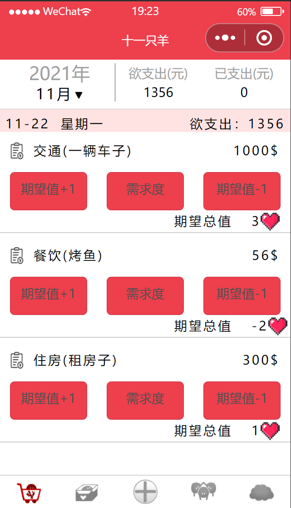

# joyTally
“十一只羊”是为了帮助在商品大打折时期容易冲动消费的的用户，帮助其挑选自己真正需要的商品，避免冲动消费导致的后期“剁手flag”。在主页有多种分类可供消费者添加自己的意愿商品，在“看中商品”到“付款购买”这两个阶段中通过用户对该商品反馈，计算出该商品的“购买意愿”和“需求度”，用以给用户一个参考——自己是否真的需要购买这件东西。除此以外，在“需求度”设置时，我们会对用户提供一些外来网站的对应参考，便于用户考虑；其次我们还添加心愿清单可供用户规划个人资金，以便于用最合适的方法获取想要的东西；另外还开设了用户社区，可以与小伙伴共同分享物美价廉的商品。本人保证不会泄露用户的私人信息，可以放心授权;“反馈与建议”功能还在开发中，后续也会持续更新一些新的功能，希望大家多多支持哦~。总而言之，目前还有很多功能有待完善与开发，敬请期待吧！❤^_^
# 主要功能的部分图片展示

## 主页页面

## 心愿页面

## 添加页面

## “我的”页面

